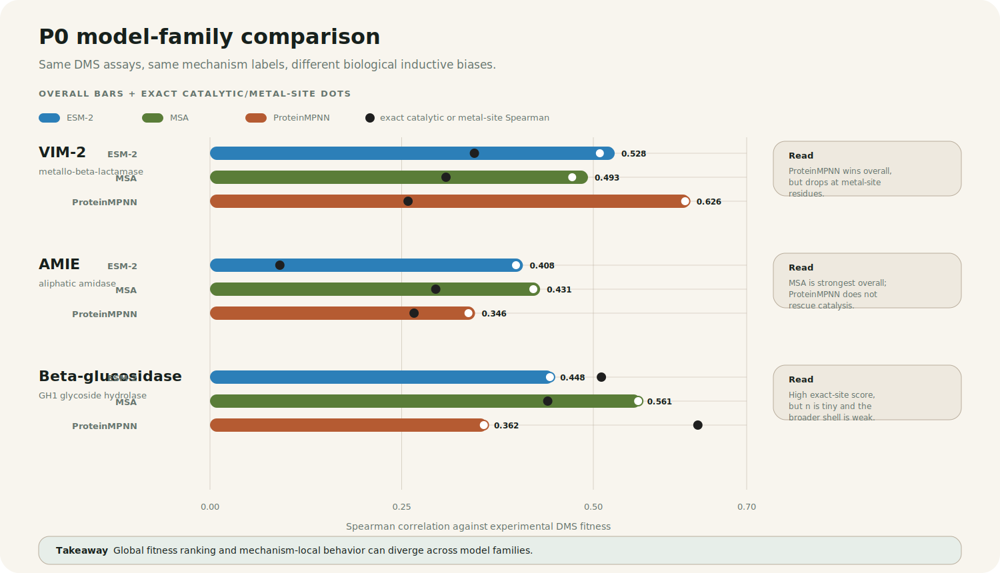

# P0 Portfolio Card: Mechanism-Sliced Zero-Shot Fitness

## One-Line Summary

I built a reproducible enzyme DMS benchmark showing that ESM-2 scale improves global zero-shot fitness prediction, while mechanism-specific claims need residue-slice controls.

## Main Figure

## Scientific Question

Do protein language models fail differently near catalytic and mechanism-relevant residues than across the rest of an enzyme?

## What I Built

- A Python benchmark package with a CLI, tests, typed records, and reproducible JSON/CSV/SVG outputs.
- A four-enzyme ProteinGym panel: TEM-1, VIM-2, AMIE, and beta-glucosidase.
- ESM-2 masked-marginal scoring at 8M and 35M scale.
- Residue-slice evaluation for exact catalytic or metal-binding sites, active-site neighborhoods, structure-derived mechanism shells, and background residues.
- Experimental VIM-2 ligand-pocket labeling from the 5ACX/WL3 inhibitor-bound structure.
- Bootstrap intervals, matched residue-position null controls, and covariate-matched null controls.
- A model-family comparison across ESM-2, MSA conservation, and ProteinMPNN.
- Savio SLURM workflows for GPU scoring and artifact recovery.

Full package: [P0 Final Project Package](p0_final_project_package.md)

## Result Snapshot

| Enzyme | Overall Spearman | Exact Site | Active-Site Neighborhood | Matched-Null Read |
| --- | ---: | ---: | ---: | --- |
| TEM-1 | 0.5548 | 0.4596 | 0.7027 | Active-site neighborhood clears null, p = 0.012 |
| VIM-2 | 0.5280 | 0.3449 | 0.6133; WL3 contact 0.6613 | Inside null, p = 0.142; WL3 contact inside null, p = 0.186 |
| AMIE | 0.4082 | 0.0911 | 0.4335 | Inside null, p = 0.778 |
| Beta-glucosidase | 0.4481 | 0.5105 | 0.4327 | Inside null, p = 0.984 |

## Interview Explanation

P0 started as a simple question: does ESM-2 behave differently near enzyme catalytic residues? I began with TEM-1 beta-lactamase, then expanded to VIM-2, AMIE, and beta-glucosidase so the result would not be a one-enzyme story.

The key result is that ESM-2 35M improves global zero-shot ranking across all four enzymes, but exact catalytic-site slices are small and noisy. TEM-1 active-site neighborhood is the only 35M mechanism slice that clears matched-position null controls. VIM-2, AMIE, and beta-glucosidase show why matched controls matter: raw mechanism-slice scores can look strong but still be ordinary relative to same-size random residue-position groups.

The pre-report control upgrade narrows the claim further. TEM-1 active-site neighborhood remains the strongest positive mechanism-local signal after mutation-count, fitness-variance, fitness-distribution, and structure-contact controls, but it becomes borderline under the strict combined covariate control. AMIE and beta-glucosidase become useful counterexamples rather than inconvenient results.

The MSA and conservation-plus-SASA upgrades narrow the claim again. ESM-2 35M beats MSA conservation overall on TEM-1 and slightly on VIM-2, but MSA conservation beats ESM-2 overall on AMIE and beta-glucosidase. The new VIM-2 5ACX/WL3 ligand-contact group gives a stronger biology label and the highest raw VIM-2 slice, but after matching mechanism slices on both MSA conservation and approximate solvent exposure, no 35M mechanism slice cleanly clears the null interval.

The ProteinMPNN upgrade adds the structure-conditioned model-family test. On VIM-2, ProteinMPNN is strongest overall at 0.6259, but weak at curated metal-binding residues at 0.2583 versus 0.6197 outside the group. That is the cleanest interview result from this phase: fixed-backbone compatibility can be globally useful while still missing mechanism-local metal-site behavior.

Beta-glucosidase is the useful scaling counterexample. At 8M, its AF2 catalytic shell cleared matched controls. At 35M, global performance improved sharply, but the shell no longer cleared matched controls.

## What This Proves

- Aggregate model performance can hide biology-specific behavior.
- Model scale helps the global DMS ranking task.
- Residue-zone claims need matched controls before becoming biological claims.
- Covariate-matched controls make the final claim narrower, not weaker: the project now distinguishes robust, borderline, and negative mechanism-slice evidence.
- A protein ML benchmark is stronger when it separates exact catalytic chemistry, local mechanism environment, and background stability/evolutionary signal.

## What This Does Not Prove

- It does not prove ESM-2 understands catalysis.
- It does not prove active-site neighborhoods are always special.
- It includes true MSA-derived evolutionary conservation controls, but those controls show that some apparent ESM-2 signal is explainable by family conservation.
- Approximate SASA is a lightweight exposure proxy, not a full structural-biology-grade solvent-accessibility calculation.
- It is retrospective, not a prospective enzyme-design campaign.

## Next Scientific Upgrade

1. Build one visual comparing ESM-2, MSA conservation, and ProteinMPNN.
2. Add TEM-1 ProteinMPNN only after staging a target-aligned BLAT_ECOLX structure or defensible remap.
3. Add prospective validation on a new enzyme-design target.

## Website Blurb

**Mechanism-sliced zero-shot protein fitness.** I built a reproducible Python benchmark that scores enzyme DMS mutations with ESM-2, MSA conservation, and ProteinMPNN, then asks where inside enzymes each model family works. Across TEM-1, VIM-2, AMIE, and beta-glucosidase, global mutation ranking improves under different model families, but mechanism-slice effects are enzyme-specific and require matched controls. The project demonstrates biology-aware evaluation, HPC execution, production Python, and scientific communication.
